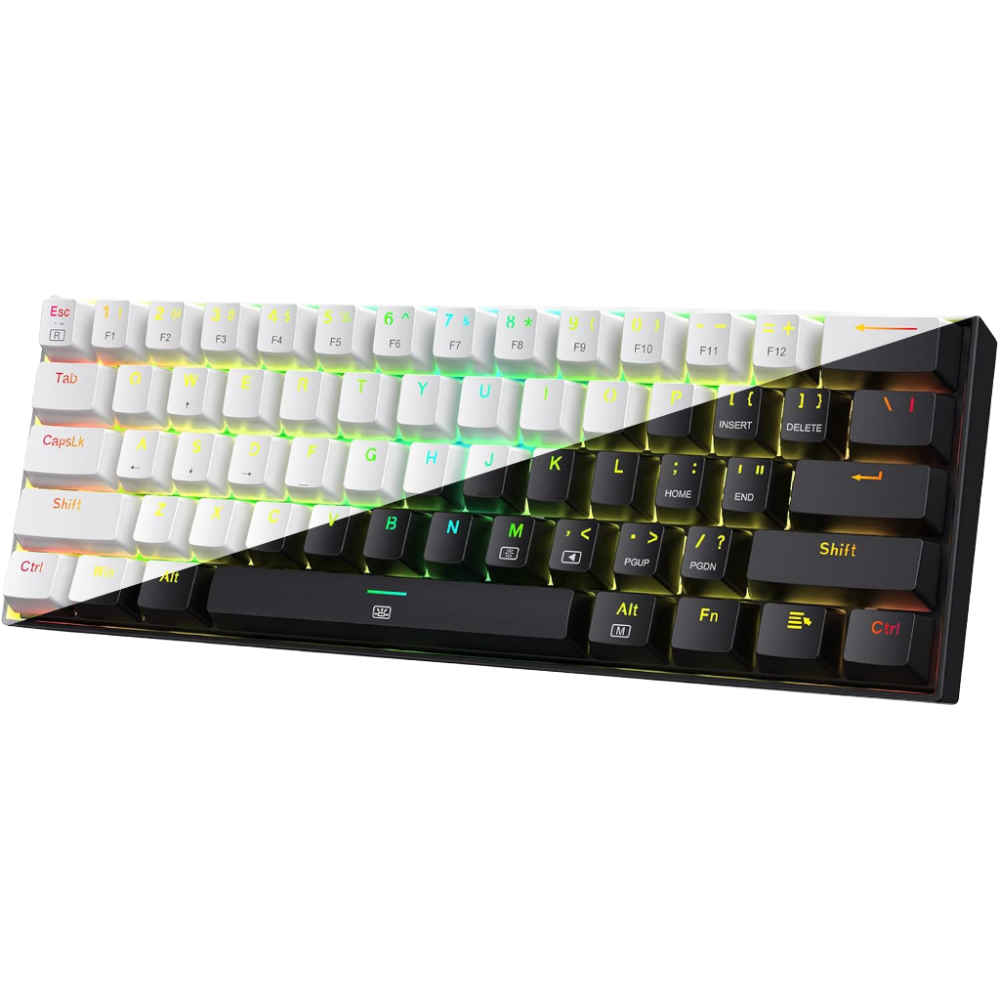

  
  &nbsp;&nbsp;&nbsp;&nbsp;&nbsp;&nbsp;&nbsp;&nbsp;
  

 

# Redragon K630 SignalRGB Plugin

A custom, standalone [SignalRGB](https://signalrgb.com/) plugin for the **Redragon K630 (Dragonborn)** 60% keyboard. 

This plugin directly interfaces with the keyboard's EVision microcontroller (VID: 0x320F, PID: 0x5000), providing a fully mapped 61-key ANSI Matrix. It fixes the lighting misalignment and unlit keys (such as `[`, `]`, `\`, and `;`) that occur when trying to use the default Redragon Kala V2 profile.

## Features
- **Perfect 61-Key Mapping**: All keys on the K630 60% layout are accurately mapped to the SignalRGB canvas.
- **Standalone Module**: Does not modify or inject code into default SignalRGB EVision scripts.
- **Direct EVision Communication**: Correctly utilizes the checksum calculation and packet splitting required by the K630's MCU.

## Installation

1. Download the `Redragon_K630.js` file from this repository.
2. Open Windows Explorer and navigate to your SignalRGB Plugins folder:
   `%USERPROFILE%\Documents\WhirlwindFX\Plugins`
3. Place `Redragon_K630.js` into this folder.
4. Restart SignalRGB completely (ensure it is closed from the system tray).
5. Open SignalRGB, navigate to your Devices, and look for your keyword. 
6. (Optional) If it prompts for a Forced Model, make sure to select the **Redragon K630 Custom** profile.

## Credit
* Configured specifically for the Redragon K630 ANSI standard matrix layout.
* Uses standard EVision Protocol structures based on default SignalRGB infrastructure.
